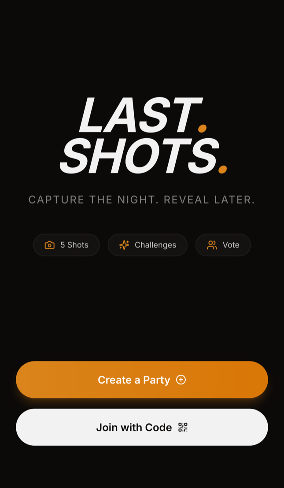
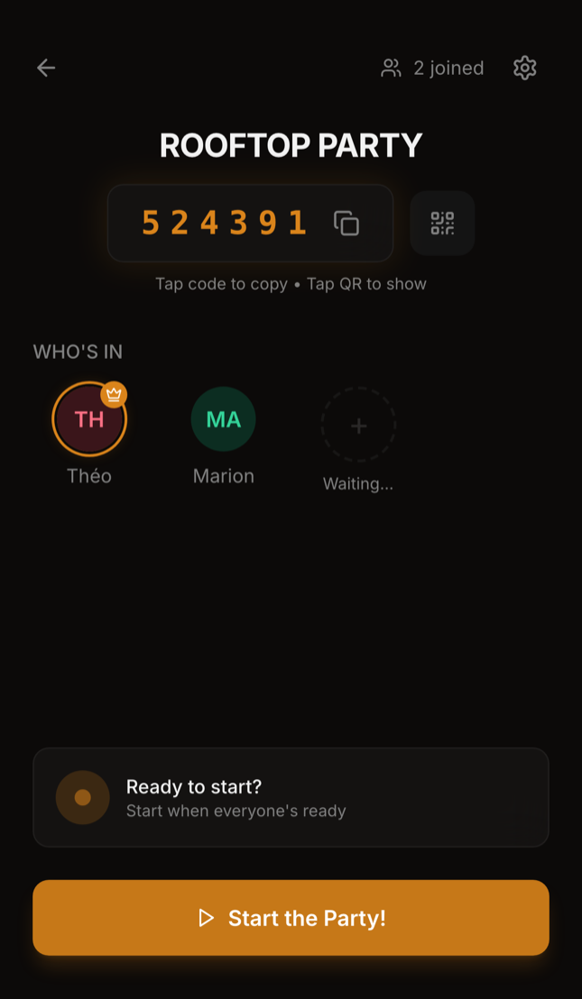
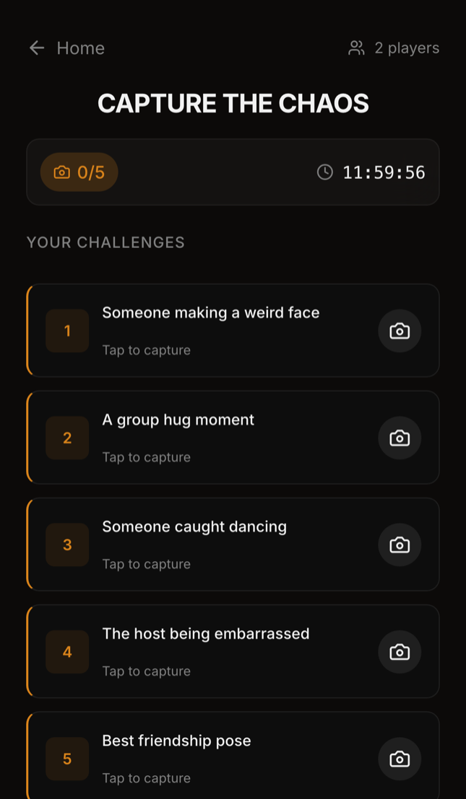

# LastShots — QA Case Study

[](https://github.com/theolegr/lastshots-qa-case-study/actions/workflows/ci.yml)

**174 unit tests · 38 E2E tests under production RLS · 99.54% mutation score · 10 bugs found, each with a regression guard**<br>
Built by [Théo Legrais](https://www.linkedin.com/in/theo-legrais) — QA automation.

A real-time social party app, used as the system under test for an end-to-end QA
case study. The app is a working product; the test layer is the work on
display.

What makes it unusual: every test runs against a real Supabase backend. No
mocked database, no `service_role` bypass, no seeded superuser — every one of the
38 end-to-end tests authenticates as an ordinary anonymous player and is subject
to the same Row Level Security policies as production. When a fixture cannot
write a row, that is a finding, not an obstacle to work around.

<p align="center">
  
  
  
</p>

<p align="center"><sub><b>creating → waiting → playing.</b> <br> The Home page, 
the lobby's six-digit code, and the capture window whose countdown is a server timestamp 
rather than a client timer.<br>Taken from a production build against the real backend.</sub></p>

---

## Where to start

| Time | Start with |
|---|---|
| 2 min | The [BUG-003 write-up](./TEST_RESULTS.md#-bug-003--72h-retention-had-silently-stopped): 114 green tests, a guarantee silently false for five weeks, and a new kind of test as the fix |
| 10 min | [`TEST_STRATEGY.md`](./TEST_STRATEGY.md): the strategy and why it is shaped this way |
| 1 hour | Clone it and run `npm test`, which needs no backend. The E2E tiers need a Supabase project of your own — see [*Run it*](#run-it) |

## Evidence you can click

The claims here are published as artefacts, so you can check them instead of
believing them. All four are regenerated on every push to `main`:

- [Playwright report](https://theolegr.github.io/lastshots-qa-case-study/playwright/) —
  every E2E test, named, timed, with traces, run under real RLS.
- [Coverage report](https://theolegr.github.io/lastshots-qa-case-study/coverage/) —
  100% of `src/lib`, enforced in CI. Scoped deliberately: a repo-wide figure
  would be larger and mean less.
- [Mutation report](https://theolegr.github.io/lastshots-qa-case-study/mutation/) —
  99.54% of mutants killed. Coverage says every branch *ran*; this says the
  suite would fail if one were wrong. The one survivor is explained, not
  suppressed.
- [Load report](https://theolegr.github.io/lastshots-qa-case-study/load/) — the k6
  join burst and vote retry storm, run after the E2E suite.

Every run is also kept: [`metrics.jsonl`](https://github.com/theolegr/lastshots-qa-case-study/blob/metrics/metrics.jsonl), on its own `metrics`
branch, holds one line per run, and the [site](https://theolegr.github.io/lastshots-qa-case-study/#measurements) shows where each figure
stands and the range it has held. A mutation score is compared across runs
here, not gated on a threshold.

## How the strategy is built

- Unit — 174 tests across 10 pure-logic modules (Vitest), 100% covered. Four
  of those modules were extracted from untestable code rather than mocked
  ([why](./TEST_STRATEGY.md#extracting-logic-to-make-it-testable)).
- Flow E2E — 35 tests across 23 files (Playwright), one concern each: RLS
  tenant isolation, storage privacy, an axe-core scan over every route in the
  app, a deployment probe, an RPC column contract, and more.
- Journey E2E — 3 multi-client tests covering full party lifecycles,
  including a 3-player concurrent simulation.
- Load — 2 k6 scenarios with [recorded baselines](./TEST_RESULTS.md#measured-baselines--2026-09-01):
  a join burst (p95 249 ms against a 2 s threshold) and a retry storm that
  collapses 150 simultaneous duplicate votes to exactly one.

Which layer carries which requirement, and which of them gates a pull request,
is the [traceability matrix](./TRACEABILITY.md).

### Tiered CI

Unit tests on every pull request; a 23-test `@smoke` E2E tier, carrying the
security invariants and nine of the ten bug-regression guards, on every PR to
`main`; the full suite, then the k6 load tests, on every push to `main`
([reasoning](./TEST_STRATEGY.md#ci-tiers)).

### A guard against the documentation lying

`npm run check:docs` fails the build if a test count advertised anywhere drifts
from the tests on disk, if a bug has no write-up or no regression guard, or if
a cross-reference stops resolving. It exists because an audit once found this
README claiming four bugs while `SPECS.md` listed six.

### Traceability is checked, not typed

Every test file declares what it verifies in its header —
`// @covers IA-004, MB-003, MO-002` — and the guard reconciles those
declarations against [`TRACEABILITY.md`](./TRACEABILITY.md) in both directions.
Its first run found five wrong rows in a matrix reviewed by eye more than once.

## What it found

**Ten bugs found, all resolved** — each written up in
[`TEST_RESULTS.md`](./TEST_RESULTS.md#bugs-confirmed-by-tests) with what exposed it,
and traced to its requirement and guard in
[`TRACEABILITY.md`](./TRACEABILITY.md#bug--requirement--guard).

Read the right-hand column in order: it starts where everyone starts — *the
suite found it* — and then the signal moves outside the suite (a lint warning,
the compiler), then outside the code entirely (auditing an excuse, re-reading a
test everyone had called flaky). That progression is what this repository is
evidence for. The tooling is the easy half.

| | What it was | What exposed it |
|---|---|---|
| **BUG-001** | Party settings did not reach guests | A cross-client journey assertion — defaults hid the split from any single-client test |
| **BUG-002** | `/join` gave a misleading error for codes that never existed | One `toast.error` covering two different failures. Blocking worked; the diagnosis lied |
| **BUG-003** | 72h retention had silently stopped for five weeks | *Nothing.* 114 tests were green. The edge function existed and was correct, but had never been deployed after a project migration |
| **BUG-004** | A notification fired when nothing had happened | *A lint warning, not a test.* 147 tests were green, because none asserted how *often* a notification fires |
| **BUG-005** | The same player rendered twice in the lobby | CI only — never reproduced locally. The race needs the timing a slower machine provides |
| **BUG-006** | A client that missed one Realtime message never recovered | Journey 3 in CI. The polling fallback treated a deadline being *set* as it being *current*, so the safety net switched itself off exactly when needed |
| **BUG-007** | A player waiting on `/vote` never left the locked phase when the capture window closed | *The TypeScript compiler*, flagging a setter nothing called. Every fixture seeded a deadline already past, so no test ever crossed the boundary |
| **BUG-008** | `/capture/:code` left the user on a spinner that never resolved when the party did not exist | Re-reading a gap filed as untestable: no client can delete a party, but the *state* a deletion leaves behind is one URL away |
| **BUG-009** | One session provisioned two anonymous identities on every cold page load | *A test that had been saying so for three weeks*, twice filed as flakiness. The suite was right and the reading of it was wrong |
| **BUG-010** | A player refused by the sign-in rate limit sat on a blank loading screen forever | *Nothing.* Found by pointing a `429` at the production build to see what a rate-limited player sees: a blank screen |

## Lessons learned

1. *Almost nothing important was found by a test.* BUG-003, BUG-004, BUG-007,
   the unverified fixture writes, a CI trigger that skipped stacked PRs — every one came from reading,
   auditing, or a compiler. The suite is excellent at application behaviour
   under real RLS and structurally blind to the infrastructure around it.
2. *A guard is a claim.* Three guards here once passed against the error they
   were written to catch. Each is now watched failing before it is trusted.
3. *Measure before estimating.* "Dozens of type errors" was 9. "~25
   sign-ins" was 104. Every estimate carried on plausibility was wrong, and
   cheap to check.
4. *A decision is not a debt.* Desktop viewports, pinch zoom, the export
   snapshot — recorded as decisions with their costs, not as gaps.
5. *The documents drift where nobody is looking*, which is why a guard checks
   them on every push.

## Who wrote what

**The application was generated with [Lovable](https://lovable.dev) and extended
with AI assistance; it is here as the system under test.** The work on display is
the test layer: everything under `tests/`, the requirements in `SPECS.md`, the
strategy in `TEST_STRATEGY.md`, the chain in `TRACEABILITY.md`, and the
pure-logic modules under `src/lib/` that were extracted from `api.ts` precisely
to make business rules reachable by a fast test.

The suite was built against a codebase written by something else, with no
specification to work from. Recovering the implicit rules, writing them down as
testable requirements, and finding where the implementation disagreed with them
is the actual job. Ten bugs came out of it, each with the test that now guards it.

Published from a private working repository — this is the finished case study;
the development log and day-to-day history stay there.

## Documentation

| File | What's in it |
|---|---|
| [`SPECS.md`](./SPECS.md) | State model, numbered requirements, risk taxonomy |
| [`TRACEABILITY.md`](./TRACEABILITY.md) | The chain: requirement → layer → test → bug, reconciled against the tests on disk by CI; the bug inventory |
| [`TEST_STRATEGY.md`](./TEST_STRATEGY.md) | Strategy and rationale, harness and selectors, CI tiers, what is not tested and why |
| [`TEST_RESULTS.md`](./TEST_RESULTS.md) | Recorded runs, mutation and load baselines, the measurements history, the bug write-ups |
| [`ARCHITECTURE.md`](./ARCHITECTURE.md) | Schema, file structure, API inventory, pure-logic modules, environment setup |

## The product, briefly

Players join a party via a 6-digit code, complete photo challenges during a
capture window, then vote on the revealed photos before a podium is computed.

**Stack:** Vite + React + TypeScript · Supabase (anonymous auth, Postgres + RLS,
private storage, Realtime) · Tailwind + shadcn-ui.

Shipped to a private beta. The password gate has since been removed — it was a
client-side constant, visible in the bundle, and never a security boundary.

## Run it

```sh
git clone https://github.com/theolegr/lastshots-qa-case-study
cd lastshots-qa-case-study
npm install
npm test       # unit tier — no backend needed
```

The E2E suite runs in CI against the Supabase project behind this repository —
the [Playwright report](https://theolegr.github.io/lastshots-qa-case-study/playwright/)
is the evidence. Running it yourself needs a Supabase project of your own, with
the migrations in `supabase/migrations/` applied.

## Run the tests

```sh
npm test                                  # unit (sub-second)
npx playwright test --grep @smoke         # the PR gate
npx playwright test                       # full E2E suite
npm run check:docs                        # the documentation guard
```

Load tests hit real Supabase, so credentials go in inline:

```sh
k6 run --env SUPABASE_URL=... --env SUPABASE_ANON_KEY=... tests/load/join-flow.js
```

## License

[MIT](./LICENSE) — Copyright (c) 2026 Théo Legrais.

Since this README says the application was generated: the Lovable-authored code
was produced for this project, and Lovable's terms assign it to the generating
account. The licence covers the repository on that basis.
