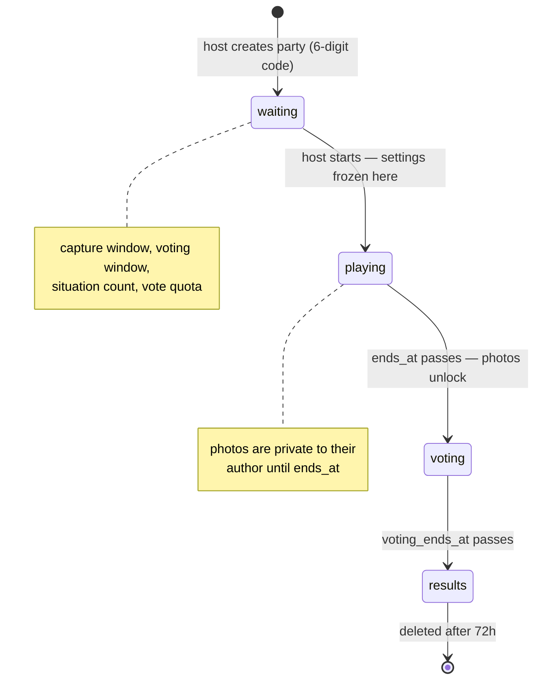

# 📏 LastShots — Specifications & Risks

The source of truth for the **state model**, **requirements** and **risk
taxonomy**. Which test verifies each requirement, and which bug violated it, is
in [`TRACEABILITY.md`](./TRACEABILITY.md).

---

# State Model

Every transition is driven by a **server timestamp**, not by a client event, and
propagates to connected clients over Supabase Realtime. That single design choice
is the source of most of the interesting test problems here: two clients can
disagree about the current phase, a dropped Realtime message can strand one of
them permanently (BUG-006), and a countdown reaching zero is a state change that
React cannot observe.

Phase is derived from two layers: `parties.status` handles the human-triggered
transition (`waiting → playing` when the host starts), and the timestamps
`ends_at` / `voting_ends_at` handle the time-triggered ones as the clock passes
them — no DB write needed.

> **At the deadline, the party is still in the earlier phase.** The comparison is
> strictly greater-than: a party whose `ends_at` is exactly `now` is `playing`,
> and it becomes `voting` one millisecond later. Nothing pinned this until
> mutation testing showed both `>` operators could become `>=` with the suite
> green. BUG-007 was a defect against this rule.

## States

### Waiting (`status = "waiting"`)
- Party exists
- Configurable by host (capture/voting durations, situation count, vote quota)
- Joinable
- No submissions yet

### Playing (`status = "playing"`, `ends_at` in future)
- Players submit photos
- Joinable
- Submissions allowed
- Content still hidden
- Configuration immutable

### Voting (`ends_at` passed, `voting_ends_at` in future)
- Submissions locked
- Content revealed
- Voting allowed
- Not joinable

### Results (`voting_ends_at` passed)
- Voting closed
- Results visible
- Export available
- No gameplay actions
- Not joinable

---

# Requirements / Features

## 1. Identity & Access

Defines how users are identified, authenticated, and authorized to perform actions. Covers session ownership, authentication requirements, and enforcement of access restrictions.

| ID | Requirement | Risk (if violated) |
|---|---|---|
| IA-001 | Each user shall be uniquely identified by a persistent `userId`. | Data Integrity |
| IA-002 | Each session shall be associated with exactly one user identity. | Data Integrity |
| IA-003 | Only authenticated users can access party content and perform party actions. | Access Control |
| IA-004 | Unauthorized or unauthenticated actions shall be rejected. | Access Control |
| IA-005 | User identity shall be anonymous (no email/password required) and provisioned automatically on first access. | Access Control |
| IA-006 | The user session shall persist across hard reload without re-authentication. | Reliability |
| IA-007 | When an anonymous identity cannot be provisioned, the client shall surface the failure and offer a retry, never an indefinite loading state. | Reliability |

---

## 2. Party Management

Covers the creation, configuration, and lifecycle initialization of a party. Defines party-level settings, join mechanisms, and when a party is considered active or joinable.

| ID | Requirement | Risk |
|---|---|---|
| PM-001 | The user shall be able to create a party. | Reliability |
| PM-002 | Each party shall have a unique `partyId`. | Data Integrity |
| PM-003 | Party configuration (timers, rules) shall have default values at creation and be modifiable by the host during the **waiting** state. | State Consistency |
| PM-004 | Once the party transitions to the **playing** state, configuration shall be immutable. | Game Integrity |
| PM-005 | A party join code or link shall be created at party creation. | Access Control |
| PM-006 | The host shall be able to configure `capture_hours`, `voting_hours`, `max_situations` and `max_votes` from the lobby before starting the party. | State Consistency |
| PM-007 | Configuration values set by the host shall be observable by all party members (cross-client consistency, no per-client divergence). | Data Integrity |
| PM-008 | Party state transitions shall be propagated to all party members in real-time. | User Experience Consistency |

---

## 3. Membership

Defines how users become and remain participants in a party. Covers roster management, uniqueness of membership, and eligibility to interact with the party.

| ID | Requirement | Risk |
|---|---|---|
| MB-001 | A user shall be able to join a party only when the party is in the **waiting** or **playing** state. | State Consistency |
| MB-002 | The system shall maintain an accurate list of party members. | Data Integrity |
| MB-003 | Only members shall be eligible to submit, vote, and view results. | Access Control |
| MB-004 | Membership state shall persist across refresh or reconnect. | Reliability |
| MB-005 | Only valid join links/codes shall grant access to a party. | Access Control |
| MB-006 | Failed join attempts shall surface an error that identifies the cause (party not found vs. join window closed). | User Experience Consistency |
| MB-007 | Join via QR code scan shall produce the same outcome as manual code entry; only valid 6-digit codes shall populate the party code input. | Data Integrity |

---

## 4. Prompt & Submission

Defines the gameplay content and how players contribute to it. Covers prompt assignment, photo submission rules, validation, and visibility before the reveal phase.

| ID | Requirement | Risk |
|---|---|---|
| PS-001 | Submissions shall only be allowed during the **playing** state. | State Consistency |
| PS-002 | Each party shall have a fixed set of prompts consistent across all users. | State Consistency |
| PS-003 | Each user shall have a fixed number of submissions. | Game Integrity |
| PS-004 | A user shall submit at most one photo per prompt. | Data Integrity |
| PS-005 | Submissions shall be associated with the correct user, prompt, and party. | Data Integrity |
| PS-006 | Invalid or unsupported files shall be rejected. | Reliability |

---

## 5. Reveal & Voting

Defines how players interact with revealed content to assign votes. Covers voting rules, limits, eligibility, anti-cheat constraints, and enforcement of the voting window.

| ID | Requirement | Risk |
|---|---|---|
| VT-001 | Voting shall only be allowed during the **voting** state. | State Consistency |
| VT-002 | Each user shall have a fixed number of votes, set by the host before the party starts and immutable thereafter. | Game Integrity |
| VT-003 | A user shall **not** be able to vote for their own submissions. | Game Integrity |
| VT-004 | A user shall cast at most one vote per submission. | Game Integrity |
| VT-005 | Duplicate or repeated vote actions shall not result in multiple counts. | Data Integrity |

---

## 6. Results & Export

Defines how outcomes are computed and exposed after voting. Covers score calculation, ranking, visibility of results, and availability of result data (including export).

| ID | Requirement | Risk |
|---|---|---|
| RS-001 | Results shall only be generated at the **results** state. | State Consistency |
| RS-002 | Results shall reflect only valid recorded votes. | Data Integrity |
| RS-003 | Final scores shall be consistent across all users. | Data Integrity |
| RS-004 | Ties shall be handled deterministically. | Data Integrity |
| RS-005 | Results export shall be available after result generation. | State Consistency |
| RS-006 | Result data shall remain stable across refresh and sessions. | Reliability |

---

## 7. Notifications & Player Reminders

| ID | Requirement | Risk |
|---|---|---|
| NT-001 | Users shall be notified when the party transitions between states. | User Experience Consistency |
| NT-002 | Users shall see the time left for the **playing** and the **voting** states. | User Experience Consistency |
| NT-003 | Users shall see the number of submissions they have left in the **playing** state. | User Experience Consistency |
| NT-004 | Users shall see the number of votes they have left in the **voting** state. | User Experience Consistency |

---

## 8. Moderation, Safety & Content Access

Defines how party data and media are protected, retained, and exposed only to authorized users.

| ID | Requirement | Risk |
|---|---|---|
| MO-001 | Parties shall be retained for at most 72 hours after creation, after which they are permanently deleted. | Reliability |
| MO-002 | All party data access shall be enforced by row-level security policies tied to the authenticated user identity. | Access Control |
| MO-003 | Photo storage shall use private buckets accessible only via signed URLs. | Access Control |
| MO-004 | Signed URLs for photo access shall expire after 7 days. | Access Control |
| MO-005 | A client whose party stops resolving — deleted past retention, or a code reached by direct navigation that matches no party — shall surface an error and return the user to a screen they can act from, never an indefinite loading state. | Reliability |

---

## 9. Accessibility

Covers whether the interface can be operated by someone not using it the way its
designer did. Written on 2026-09-09, after a coverage question had no requirement
to answer to: the suite had run an axe scan since 2026-08 with nothing in this
document saying what it was checking against.

Deliberately narrow. These are the rules that are **automatically verifiable and
enforced**, not a statement that the app is accessible — screen-reader narration
and keyboard-only operation are a manual discipline recorded as out of scope in
`TEST_STRATEGY.md`. A requirement that overstates what is checked is worse than none.

| ID | Requirement | Risk |
|---|---|---|
| AC-001 | Every interactive control shall expose an accessible name — visible text, `aria-label`, or `aria-labelledby`. | Accessibility |
| AC-002 | Text shall meet the WCAG 2.1 AA contrast minimum against its background: 4.5:1 for normal text, 3:1 for large. | Accessibility |

These two are the rules that have actually fired against this codebase, stated
as properties of the product rather than of a tool; the suite asserts axe's
whole serious/critical class, which is broader. Pinch zoom is deliberately not a
requirement: it stays disabled by product decision, recorded in
`TEST_STRATEGY.md` → *Deliberate boundaries*.

---
---

# Risk Taxonomy

## 1. Game Integrity

**Definition:** Failures that allow players to gain unfair advantage or break core gameplay fairness.

**Failure Modes:**
- Unauthorized scoring advantage
- Rule bypass
- Premature information access

**Examples:**
- Self-vote
- Exceeding vote limit
- Seeing hidden content before reveal

---

## 2. Data Integrity

**Definition:** Failures where stored or computed data is incorrect, inconsistent, or duplicated.

**Failure Modes:**
- Incorrect aggregation
- Duplicate records
- Data mismatch across views

**Examples:**
- Wrong vote counts
- Duplicate submissions
- Inconsistent results between users

---

## 3. State Consistency

**Definition:** Failures in lifecycle progression, timing enforcement, or state transitions.

**Failure Modes:**
- Invalid state transitions
- Boundary timing errors
- Concurrent state conflicts

**Examples:**
- Voting outside allowed window
- Results visible too early
- Race conditions at voting boundary

---

## 4. Access Control

**Definition:** Failures where users can access or perform actions beyond their permissions.

**Failure Modes:**
- Unauthorized read access
- Unauthorized write/action
- Missing membership enforcement

**Examples:**
- Non-member accessing party content
- Accessing results without permission
- Performing actions without proper authorization

---

## 5. Reliability

**Definition:** Failures caused by real-world conditions where the system behaves unpredictably or inconsistently.

**Failure Modes:**
- Duplicate execution
- Partial completion
- Network-dependent inconsistency

**Examples:**
- Double clicks causing duplicate actions
- Retry leading to duplicated votes or submissions
- Network interruption during upload or vote
- Partial failures (action succeeds but UI doesn't reflect it)

---

## 6. User Experience Consistency

**Definition:** Failures where the system behaves correctly technically but confuses or misleads the user.

**Failure Modes:**
- Lost or hidden state
- Ambiguous feedback
- Broken interaction flow

**Examples:**
- Lost progress after refresh
- No feedback after action
- UI flow breaks or becomes inconsistent

---

## 7. Accessibility

**Definition:** Failures where the interface is operable by some users and not by
others, for reasons unrelated to what the software is doing. Added 2026-09-09,
because the six categories above could not hold the two findings that opened it
without distorting one of them — an icon button with no accessible name is not
*ambiguous feedback*, it is a control that does not exist for the user, and no
amount of correct behaviour behind it helps.

**Failure Modes:**
- A control that assistive technology cannot name or reach
- Content whose presentation makes it unreadable to part of the audience
- An interaction that assumes one input modality

**Examples:**
- An icon-only button announced as "button" and nothing else
- Text below the contrast floor for its size
- A gesture with no keyboard or single-pointer equivalent
